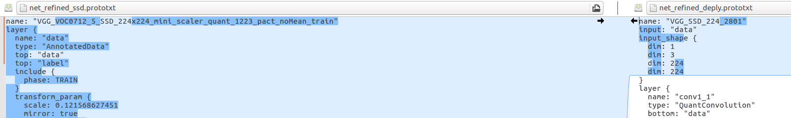
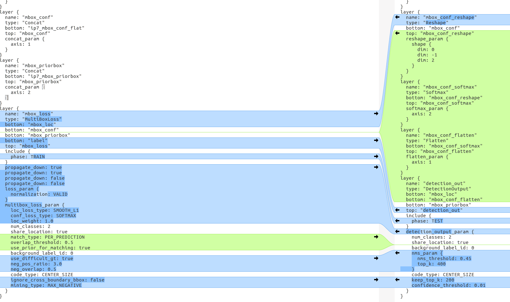

## CAFFE_VGG-SSD的训练流程样例 (5801)

```tex
1.face.tar.gz是数据集
2.caffe-ssd.tar.gz是caffe-ssd的包
3.在caffe_MDK里面安装的文件夹里面的readme.txt文件，里面需要替换的data_transformer.cpp使用这个文件夹里面给的，MDK里面给的data_transformer.cpp是针对caffe-1.0的。
4.SSD_face_iter_77681.caffemodel是预训练模型
5. VGG_SSD_224_5801_test.prototxt是测试的prototxt
   VGG_SSD_224_5801_train_quant.prototxt是训练的prototxt
   上面的两个文件在solver_face.prototxt里面指定
```


```tex
对于5801芯片来说，每一层输入输出之和不能大于 4816896
1. 浮点：
   在data层里面把
   data_param{
       source:xxx_path 改为 数据集路径
   }，46行
   把前五层卷积里面的quant_convolution_param里面的coef_precision的值改为FLOAT_POINTING, prototxt里面的分类结果根据自己的分类情况修改。
   /home/xxx/caffe-ssd/build/tools/caffe train --solver=solver.prototxt --weights=vgg16.caffemodel --gpu 0 2>&1 | tee log.log
   这一步会生成caffemodel模型文件,作为下一步的预训练模型.
   执行每一步训练都需要修改solver_face.prototxt里面指定的网络文件(vgg.prototxt)
   
2. GTI自定义的方式量化convolution.
   在浮点的基础上修改test和train的prototxt,将前三层的把前五层卷积里面的quant_convolution_param里面的coef_precision的值改为THREE_BITS，后两层的coef_precision的值改为ONE_BIT。
   查看芯片使用哪一个bits数目最合适，参照下面的计算：
   每一层的input_channel x output_channel / 压缩比，将每一层计算的结果相加之和小于489216
   压缩比：1bit压缩比是4，3bits压缩比是2，8bits压缩比为 1 (DYNAMIC_FIXED_POINT代表芯片支持的最高的bits数目).
   /home/xxx/caffe-ssd/build/tools/caffe train --solver=solver.prototxt --weights=vgg16_float.caffemodel --gpu 0 2>&1 | tee log.log
   
3. GTI自定义的方式量化ReLU.
   在train/script/ 里面执行 python CalibrateQuantReLU.py 将脚本里面的123行的prototxt路径改为第二步使用的prototxt,124行的model改为第二步训练生成的caffemodel,执行之后生成新的prototxt和caffemodel.新生成的文件作为第三步训练的prototxt和与训练模型.
   **注：在执行CalibrateQuantReLU.py之前需要把prototxt里面data层里面的include里面
   include{
   	   phase:TRAIN # TRAIN改为TEST
   } 8行，
   检查一下 新的prototxt里面每一个QuantReLU层中 quant_enable 为 true以及将 注 里面的TEST改为TRAIN以及将VGG_SSD_224_5801_test.prototxt里面的前五层一定要和train文件夹完全一致
   /home/xxx/caffe-ssd/build/tools/caffe train --solver=solver.prototxt --weights=vgg16_quant_relu.caffemodel --gpu 0 2>&1 | tee log.log

4. fusion模型
   在train/script/ 里面执行 python RefineNetWork.py 将251行的prototxt改为第三步训练的prototxt,252行的caffemodel改为第三步新生成的caffemodel文件. 执行之后生成新的prototxt和caffemodel.新生成的文件作为第四步训练的prototxt和与训练模型.
   **注：RefineNetWork.py之前需要把prototxt里面data层里面的include里面
   include{
   	   phase:TRAIN # TRAIN改为TEST
   } 8行，
   检查一下 新的prototxt里面每一个QuantConvolution层中 shift_enable 为 true以及将 注 里面的TEST改为TRAIN以及将VGG_SSD_224_5801_test.prototxt里面的前五层一定要和train文件夹完全一致.
   /home/xxx/caffe-ssd/build/tools/caffe train --solver=solver.prototxt --weights=net_refined.caffemodel --gpu 0 2>&1 | tee log.log
   
5. 模型转换
   假设第四步训练做好的模型为 vgg_20000.caffemodel
   在转换前需要讲 net_refine.prototxt改为net_refine_deploy.prototxt文件，详细见图1，在文件夹里面也提供了net_refine_deploy.prototxt作为参考。只需要修改data层以及mbox_loss层
   1) 在conversion_tools文件夹里面进行转换.network_examples/5801文件夹下找到network5801_vgg-16_template.json(下面简称network)文件和fullmodel_def5801_vgg-16_template.json(下面简称fullmodel)
   2) 我们的SSD网络里面的卷积使用的是标准的vgg16网络,没有从中间层down出来的部分,所以network文件不需要修改,在fullmodel文件里面把fc层去掉,softmax层以及label层去掉.
   3) 如果自己修改的vgg-ssd网络,从中间卷积层添加的有分支,需要在转化上芯片的时候down出来数据,要在network里面把需要down出来数据的那一层的last_layer_out设置为true,这样出来的数据是不经过pooling的.
   下面的json文件是介绍network里面各个参数的作用.改完json文件之后执行:
   labels.txt 是打标的标签
   python convert.py -h 查看需要的参数,比如 
   python convert.py ssd/*.prototxt ssd/vgg_20000.caffemodel ssd/network5801_vgg-16_template.json ssd/fullmodel_def5801_vgg-16_template.json -o label=labels.txt
   这样生成新的.model文件,这个文件就是上芯片的model模型.
6. 剩下的fc部分通过ncnn转成.param文件和.bin文件,具体可参考文件VGG_SSD_5801.prototxt文件
   以及网址 https://blog.csdn.net/soralaro/article/details/81131615?utm_source=blogxgwz0
   只需要生成新的.param和.bin文件
   
```





​																					图1

### network.json文件部分参数

```json
"layer": [
    {
      "image_size":             224,  # 输入图片的尺寸
      "input_channels":         3,  # 输入的通道数
      "output_channels":        64,  # 输出的通道数
      "sublayer_number":        2,  # 每个大层里面有几个小层
      "coef_bits":              3,  # 这一层的bits数
      "pooling":                true,  # 最后卷积是否有pooling， stride=2，也是类似于pooling降维
      "learning":               false,  # 输出每一个小层的数据
      "last_layer_out":         false  # 输出这一大层出来的数据，不经过pooling
    }
```

### fullmodel.json

```json
{
    "layer": [
        {
            "data file": null,
            "data offset": null,
            "input format": "CS_BGR24_PLANAR", 
            "name": "image reader",  
            "operation": "IMAGEREADER",
            "output channels": 3,                    # 输入的通道数
            "output format": "CS_BGR24_PLANAR",
            "output height": 224,                    # 输入的图片尺寸
            "output width": 224
        },
        {
            "name": "cnn",
            "operation": "GTICNN",
            "data file": "coef.dat",
            "device": {
                "chip": "5801",
                "type": 0,
                "name": null
            },
            "mode": 0,                              
            "data offset": 0,                       
            "output scaledown": 3,                  # 定义fc层有几个，ssd可以去掉这个
            "output channels": 512,                 # 转换上芯片后，芯片出来的尺寸，比如vgg16是
            "output width": 7,
            "output height": 7
        }
    ],
    "name": "gti_5801_vgg16_1-3bit"
}

```

### solver.prototxt参数

```tex
net: "mobilenet_448_train.prototxt"   # 使用训练的网络文件
test_iter: 100                        # 测试的批次，测试样本较多时，需要分几次批次执行
test_interval: 100                    # 测试间隔，这个是没训练100次，测试一次，根据情况自己调整
base_lr: 0.001                        # 学习率
lr_policy: "step"                     
gamma: 0.95                           # 学习率变化的比率
stepsize: 1000                        # 每迭代1000次，调整一次学习率
display: 100                          # 每迭代100次，在终端显示一次
max_iter: 150000                      # 最大的迭代次数
momentum: 0.9                         # 学习的参数
weight_decay: 0.0002                  # 权重衰减项，防止过拟合
snapshot: 2000                        # 每迭代 2000 次，保存一次模型
snapshot_prefix: "models/snapshot"    # 模型保存的路径
solver_mode: CPU                      # 训练使用CPU训练，如果是GPU，修改为GPU
```

### 测试转换模型的数据是否和caffe的模型的数据完全一致

```tex
1. test_caffe_data.py是用来测试没上芯片前ceffemodel的数据。
   在SDK5.0 App/Demo的main.cpp文件里面把第95行的output的数据打印出来，如何数据能和test_caffe_data.py的数据对的上，那就表明转换没有问题。
```


